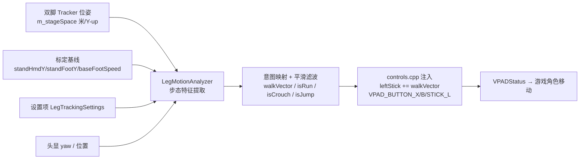

# BotW-BetterVR · 腿部体感移动（原地走/跑驱动长距离位移）· 分阶段系统设计方案

> 角色：架构师 **高见远（Gao）**
> 目标项目：BotW-BetterVR（Cemu 上 BOTW 的 VR mod，C/C++，OpenXR + SteamVR runtime）
> 设备：Pico Neo 3（ALVR + SteamVR 串流）→ Pico Motion Tracker 作为 SteamVR Tracker，角色指派 Left/Right Foot
> 主路径：`XR_HTCX_vive_tracker_interaction`（已用户实测可行，不走 `XR_FB_body_tracking` 备选）
> 源码核查基线：`openxr.h`、`openxr.cpp`、`controls.cpp`、`mod_settings.h`、`controller_bindings.h`、`imgui_menus.cpp`、`BotW-BetterVR_LegTracking_Plan.md`、`BotW-BetterVR_LegTracking_DevPlan.md`

---

## 0. 一句话思路与数据流总览

**思路**：每帧从 OpenXR 读双脚 tracker 的房间系位姿 → 在 `LegMotionAnalyzer` 里做**步态周期检测**（支撑/摆动相位）→ 估计**步频 / 步幅 / 移动向量** → 经 EMA 滤波 + 死区 + 增益映射成玩家前/右轴移动意图与跑/跳/蹲判定 → 叠加进现有 `leftStickSource`（死区之后、`processJoystickInput` 之前）并置对应 `VPAD_BUTTON_*` → 复用现有 VPAD 注入通道驱动角色控制器。**不重写移动系统，所有新增设置默认关闭。**



---

## 1. 与现有方案（LegTracking_Plan.md）的关系与升级点

现有 `BotW-BetterVR_LegTracking_Plan.md` 的 Step 3 只用「双脚水平速度平均取反 → 死区/增益 → walkVector」，**没有显式步态结构**，存在两个缺陷：

1. **双支撑期掉速**：原地踏步时双脚常同时接近静止（速度≈0），平均取反会把移动向量归零，导致「走走停停」的顿挫感。
2. **无法区分走/跑**：仅靠平均脚速阈值判断奔跑，慢走快频率 vs 快走低频率易误判；缺少步频/步幅证据。

**本次增强（步态特征层）**，在 `LegMotionAnalyzer` 内新增：

| 现有方案 | 本次升级 |
|---|---|
| 平均脚速取反 | **摆动脚优先 + gait 周期检测**：用处于摆动相（速度更高）的脚的速度取反作为身体意图，双支撑期由 EMA 保持，不再归零 |
| 无步态概念 | 显式 **步态相位机**（STANCE / SWING / DOUBLE_SUPPORT）、**步频 `stepFrequency`（步/秒）**、**步幅 `strideLength`（复步米）** |
| 仅 `runSpeedThreshold` 判跑 | 跑判定 = `stepFrequency > runStepFrequency` **或** `平均脚速 > runSpeedThreshold` **或** `strideLength > runStrideLength`，带滞回 |
| 无周期对齐 | 移动向量以 **gait cycle 相位**做跨步平滑，输出更连续稳定 |

> 整合方式、扩展启用、动作/绑定、注入点均**沿用**原案，仅把「算法内核」从"平均取反"升级为"步态特征 + 摆动脚选择 + EMA"。

---

## 2. 分阶段实现计划（核心）

> 6 个阶段逐一覆盖 6 个子模块；每阶段含：目标 / 任务与文件 / 关键设计决策与算法 / 交付内容 / 进入下一阶段验收（done 条件）。
> 顺序遵循「诊断先行、算法后落、最后 UI」以降低返工（与原 DevPlan 一致）。

### 阶段 1 —— 子模块①：获取双脚控制器位姿与位移数据

**阶段目标（一句话）**：启用 Vive Tracker 扩展、创建足部动作/空间/绑定，每帧把左右脚 tracker 位姿与速度写进 `Shared`，并打印诊断确认 `isActive=true` 且数据合理。

**具体任务（文件 / 模块）**
| 子任务 | 文件 | 动作 |
|---|---|---|
| (a) 探测扩展 | `src/rendering/openxr.cpp` 枚举循环（33–83 行） | 仿 `XR_EXT_HP_MIXED_REALITY_CONTROLLER` 写法检测 `XR_HTCX_vive_tracker_interaction_EXTENSION_NAME`，命中则 `enabledExtensions.emplace_back(...)` |
| (b) 类成员 | `src/rendering/openxr.h` | 加 `bool m_supportsViveTracker = false;`、`XrAction m_footPoseAction`、`std::array<XrPath,2> m_footPaths`、`std::array<XrSpace,2> m_footSpaces`；并在 `Capabilities`（18–31 行）加 `bool supportsViveTracker = false;` |
| (c) 创建动作 | `src/rendering/openxr.cpp` `CreateActions()`（332–466） | 新增 `createActionEx` 重载（允许 `subactionPaths` 指向 `m_footPaths`）；在 gameplay action set 内创建 `foot_pose`（POSE_INPUT）；循环 `xrCreateActionSpace` 到 `m_footSpaces[i]`（仿 439–448） |
| (d) 绑定 | `src/utils/controller_bindings.h` | 新增 `XrAction footPoseAction` 到 `ControllerActionBindings`（13–42）；在 `SuggestControllerBindings` 末尾加 HTCX Vive Tracker 交互配置块：`/interaction_profiles/htcx/vive_tracker_htcx`，把 `footPoseAction` 绑到 `/user/vive_tracker_htcx/role/left_foot/input/grip/pose` 与 `right_foot/...`（用 `SuggestProfileBindings`，`fatalOnUnsupported=false`） |
| (e) Shared 字段 | `src/rendering/openxr.h` `InputState::Shared`（60–76） | 加 `std::array<XrSpaceLocation,2> footPoseLocation{}`、`std::array<XrSpaceVelocity,2> footPoseVelocity{}`、`std::array<XrActionStatePose,2> footPose{}` |
| (f) 每帧定位 | `src/rendering/openxr.cpp` `UpdateActions()` | **重构 `locatePose` lambda（527–568）增加 `XrPath subactionPath` 参数**，对手调用 `m_handPaths[side]`、对脚调用 `m_footPaths[side]`；在手部循环（570–587）之后，对左右脚各 `locatePose(m_footPoseAction, m_footSpaces[i], footPose[i], footPoseLocation[i], &footPoseVelocity[i], ...)`。`isActive==false` 时原 lambda 已优雅跳过 |

**关键设计决策**
- **复用 `locatePose`**：原 lambda 已处理 `xrGetActionStatePose` + `xrLocateSpace(m_stageSpace)` + 速度有效性。`XR_SPACE_VELOCITY_LINEAR_VALID_BIT` 等标志由原代码判断，脚速度直接来自 `XrSpaceVelocity.linearVelocity`（世界系 m/s）。只需把硬编码的 `m_handPaths[side]` 改为参数即可，不重写。
- **坐标**：所有脚位姿都在 `m_stageSpace`（房间系，Y-up，米），与手部 `poseLocation` 同坐标系，后续无需二次变换。
- **绑定稳健性**：HTCX Vive Tracker profile 在某些 runtime 不存在 → `XR_ERROR_PATH_UNSUPPORTED` 由 `SuggestProfileBindings(..., fatalOnUnsupported=false)` 吞掉并打 INFO 日志，不影响其它控制器。

**交付内容**
- 改动后的 `openxr.h` / `openxr.cpp` / `controller_bindings.h`
- 一份**诊断日志**：打印 `supportsViveTracker`、`footPose[i].isActive`、左右脚 X/Y/Z、水平速度幅值（可临时加 `Log::print<INFO>` 或正则复用现有 `LogRoomscale` 类别）

**进入下一阶段验收（done）**
- 日志显示 `supportsViveTracker=true`
- SteamVR 指派 Left/Right Foot 后，`footPose[0/1].isActive==true`，站立时坐标稳定（噪声基线 < ~0.05 m），迈步时坐标/速度出现合理变化
- 若 `isActive=false`：按硬件链路倒查（SteamVR 角色 → ALVR emulation → runtime），先解决硬件层

---

### 阶段 2 —— 子模块②：计算原地步态特征（步频 / 步幅 / 移动向量）

**阶段目标（一句话）**：实现 `LegMotionAnalyzer` 的步态特征内核——步态周期检测、步频、步幅、含方向的移动向量，纯算法可单测。

**具体任务（文件 / 模块）**
| 子任务 | 文件 | 动作 |
|---|---|---|
| (a) 数据结构 | `src/hooking/leg_motion.h` | 定义 `FootSample`、`GaitFeatures`、`LegMotionResult`、`LegMotionAnalyzer`（见第 3 节类图/结构） |
| (b) 步态周期检测 | `src/hooking/leg_motion.cpp` | `DetectGaitCycle()`：按每脚水平速度 `s=‖v.xz‖` 与是否近地判定支撑/摆动；记录每脚**足跟着地（高度局部极小值）**事件作为一步完成；滑动窗口统计步频 |
| (c) 步幅 | 同上 | 同脚相邻两次着地位置的水平距离 = 单步 `stepLength`；相隔一次的着地距离 = 复步 `strideLength` |
| (d) 移动向量 | 同上 | `ComputeMovementVector()`：选摆动相（速度更高）脚的速度取反得身体世界意图；用头显 `yaw` 旋转到玩家前/右局部系；EMA 平滑；死区；增益 |
| (e) Python 原型（非 C++ 友好） | `tools/leg_motion_lab.py` | 等价 numpy 实现 + 合成数据（原地踏步/快踏步/起跳/下蹲）+ 单测，产出默认阈值（复用 DevPlan 阶段 2） |

**关键设计决策 / 算法要点**
- **步态相位机（每脚）**：
  - `STANCE`（支撑）：`s < stanceSpeedThreshold`（默认 0.35 m/s）且脚接近标定值（`height < standFootY + 0.06`）→ 脚"钉"在地上。
  - `SWING`（摆动）：`s ≥ stanceSpeedThreshold` → 脚在挪动。
  - `DOUBLE_SUPPORT`：双脚同时 STANCE（常见于原地踏步换脚瞬间）。
- **步检测（稳健法）**：跟踪每脚高度 `y(t)`，检测**局部极小值**（足跟着地）。当从 SWING 回到 STANCE 且出现新极小值时，记一步：
  - `stepCount[foot]++`，时间戳入滑动窗口（长度 `kStepWindow=2.0s`）
  - `stepFrequency = 窗口内步数 / 窗口时长`（合并双脚除以 2 得整体步/秒）
  - `stepLength = ‖pos(本次着地) − pos(上次着地)‖`（水平）；`strideLength = ‖pos(本次) − pos(上上次)‖`
- **移动向量（核心升级）**：
  - 身体世界意图 `bodyIntent = −vSwing.xz`，其中 `vSwing` 取**当前速度更高（处于摆动）那只脚**的水平速度；若双支撑则保留上一帧 `filteredWalk`（EMA 不归零，消除顿挫）。
  - 旋转到玩家局部系：令 `forward = (sin yaw, 0, cos yaw)`，`right = (cos yaw, 0, −sin yaw)`（`yaw = atan2(fwd.x, fwd.z)`，`fwd = hmdQuat·(0,0,−1)`）：
    - `localForward = bodyIntent.x·sin yaw + bodyIntent.z·cos yaw`
    - `localRight   = bodyIntent.x·cos yaw − bodyIntent.z·sin yaw`
  - EMA：`filteredWalk = lerp(filteredWalk, target, α)`，`α = 1 − exp(−dt/τ)`，`τ = smoothingTau`（默认 0.18s，比单帧噪声大、比步周期小）
  - 死区：若 `‖filteredWalk‖ < deadzone` → 归零；增益 `filteredWalk *= walkSensitivity`；`clamp(±1)`
- **坐标系**：房间系 Y-up、米；玩家局部系 `x=右, y=前`（与 `leftStickSource` 的 `.x=右, .y=前` 一致）。

**交付内容**
- 可编译的 `leg_motion.h` / `leg_motion.cpp`（仅算法，不含注入）
- `tools/leg_motion_lab.py`（原型 + 单测 + 默认阈值表）
- 一张「四种动作 → 输出」可视化图作为与 C++ 数值对齐基准

**进入下一阶段验收（done）**
- 单测通过：原地踏步 → `walkVector` 连续非零且方向随面朝变化；快踏步 → `stepFrequency` 升高、`strideLength` 增大；站立 → 全零
- Python 与 C++ 同份数据数值对齐（浮点容差内）

---

### 阶段 3 —— 子模块③ + ④：意图映射为角色移动 + 平滑滤波与防抖

**阶段目标（一句话）**：在 `LegMotionAnalyzer::Update` 内完成「步态特征 → 移动意图（speed+heading）/ 跑/跳/蹲判定 / 滤波防抖」，产出最终 `LegMotionResult`。

**具体任务（文件 / 模块）**
| 子任务 | 文件 | 动作 |
|---|---|---|
| (a) 意图映射 | `src/hooking/leg_motion.cpp` `Update()` | 由 `walkVector` 得 speed（`‖walkVector‖`）+ heading（局部前/右）；由步态特征得 `isRun/isCrouch/isJump` |
| (b) 跑判定（滞回） | 同上 | `isRun` 进入：`stepFrequency > runStepFrequency` **或** `avgFootSpeed > runSpeedThreshold` **或** `strideLength > runStrideLength`；退出需低于阈值 `×0.8`（滞回防抖） |
| (c) 跳判定（边沿+冷却） | 同上 | 双脚高度在短时间内抬升 `> baseFootSpeed` 噪声基线 `+ jumpLiftThreshold` → 置 `isJump` 一帧 → 进入 `400ms` 冷却（状态机），防连跳；备选用脚 `linearVelocity.y` 上冲峰值 |
| (d) 蹲判定（持续态） | 同上 | `hmdPos.y < standHmdY − crouchDepth`（以标定基线为准，最稳）；需持续 `> 150ms` 去抖 |
| (e) 滤波/防抖 | 同上 | EMA（移动向量）、对脚高度用**中位滤波**（窗口 5 帧）去尖刺（跳/蹲判定）、步频 EMA、全局输入门（仅 `enabled && calibrated && 任一只脚 active` 才输出） |
| (f) Calibrate | 同上 | `Calibrate(footPos[2], hmdPos, cfg)`：把当前 `hmdPos.y→standHmdY`、`footPos 平均 y→standFootY`、静息 `avgFootSpeed→baseFootSpeed` 写入 `cfg`（即设置项，自动持久化）；置 `calibrated=true` |

**关键设计决策 / 算法要点**
- **输入门（gate）**：`enabled=false` 或 `!calibrated` 或双脚均 `!active` 时，`Update` 返回全零结果且不更新 EMA（避免松脚时漂移累积）。这保证「关闭开关后手柄完全不受影响」。
- **防连跳冷却**：跳跃是边沿事件，必须冷却；否则 tracker 抖动会每帧误触。
- **中位滤波用于高度**：高度用于跳/蹲，怕单帧尖刺；速度用于移动向量，用 EMA 即可。
- **滞回（hysteresis）**：跑/蹲阈值进/出设不同比例，避免阈值附近抖动。
- **heading 与 speed 解耦**：`walkVector` 已是「方向+幅值」的局部向量，直接喂摇杆；跑是独立布尔（置 `VPAD_BUTTON_B`），与移动幅值解耦，符合游戏「跑=加速+动作」语义。

**交付内容**
- 完整 `LegMotionAnalyzer::Update`（含 `DetectGaitCycle` / `ComputeMovementVector` / 跳/蹲状态机 / 滤波）
- 更新 `tools/leg_motion_lab.py` 含跳/蹲/跑判定
- 一套默认阈值（见第 6 节表）

**进入下一阶段验收（done）**
- 四种动作（走/跑/跳/蹲）在 Python 与 C++ 双版均正确触发且稳定（无连跳、无蹲抖、无走停顿挫）
- `enabled=false` 或 `!calibrated` → 输出恒零

---

### 阶段 4 —— 子模块⑤：与现有角色控制器整合

**阶段目标（一句话）**：在 `hook_InjectXRInput()` 中调用分析器，把 `LegMotionResult` 接入四个既有 VPAD 注入点，最小侵入。

**具体任务（文件 / 模块）**
| 子任务 | 文件 | 动作 |
|---|---|---|
| (a) 分析器单例 | `src/hooking/leg_motion.h` | 提供 `LegMotionAnalyzer& GetLegMotionAnalyzer()` 单例（controls.cpp 与 imgui_menus.cpp 共享同一状态，便于标定） |
| (b) 调用点 | `src/hooking/controls.cpp` `hook_InjectXRInput()` | 死区之后（~1096）、`processJoystickInput` 调用（1231）之前，调用 `Update` 取 `leg` |
| (c) 走动注入 | 同上 | `leftStickSource.currentState.x += leg.walkVector.x; .y += leg.walkVector.y;`（死区之后、941 之前，避免被死区吞） |
| (d) 跳/跑/蹲注入 | 同上 | 在 1144（jump_cancel）、1189（runState else 分支）、1162（crouch_scopeState）附近 `OR` 对应 `VPAD_BUTTON_*` |
| (e) 调试快照 | `src/hooking/leg_motion.cpp` | `SetLastResult()/GetLastResult()`（带 `std::mutex` 自旋锁）供浮层读取 |

**关键设计决策 / 整合点清单（精确到文件 + 位置 + 片段）**

> `leftStickSource` 取自 `inputs.inGame.move`（controls.cpp:1086）；死区在 1090–1096 应用；`processJoystickInput` 定义在 938、调用在 **1231**；跳跃 1144、下蹲 1162、奔跑 1189。

**插入点 1（走动，核心约束）**——死区之后、CONTROLLER 旋转块（1098–1116）之后、`processInputPrevention` 之前（约 1117 行）：
```cpp
// === Leg Tracking: 死区之后、processJoystickInput 之前 ===
static LegMotionResult s_legResult{};
if (gameState.in_game && GetSettings().legTracking.enabled) {
    const auto headsetPose = renderer->GetMiddlePose();
    if (headsetPose.has_value()) {
        const auto hmdMtx = headsetPose.value();
        const glm::fvec3 hmdPos(hmdMtx[3]);
        const glm::fquat hmdQuat = glm::quat_cast(glm::fmat3(hmdMtx));
        const glm::fvec3 fwd = hmdQuat * glm::fvec3(0.0f, 0.0f, -1.0f);
        const float hmdYaw = std::atan2(fwd.x, fwd.z);
        std::array<bool, 2> footActive = {
            inputs.shared.footPose[0].isActive == XR_TRUE,
            inputs.shared.footPose[1].isActive == XR_TRUE };
        s_legResult = GetLegMotionAnalyzer().Update(
            inputs.shared.footPoseLocation,
            inputs.shared.footPoseVelocity,
            footActive, hmdPos, hmdYaw, dt, GetSettings().legTracking);
        leftStickSource.currentState.x += s_legResult.walkVector.x;
        leftStickSource.currentState.y += s_legResult.walkVector.y;
    }
}
```
> 注意：放在 CONTROLLER 旋转块**之后**，使腿部移动向量始终以头显（相机）为基准，与默认 `WalkingDirection::CAMERA` 一致；`WalkingDirection::CONTROLLER` 时该块会旋转手柄摇杆但不旋转我们的腿向量，语义正确。

**插入点 2（跳跃）**——紧跟 1144 行 `mapXRButtonToVpad(inputs.inGame.jump_cancel, VPAD_BUTTON_X)` 之后：
```cpp
if (s_legResult.isJump) newXRBtnHold |= VPAD_BUTTON_X;
```

**插入点 3（下蹲）**——紧跟 1162–1164 行 `if (inputs.inGame.crouch_scopeState.lastEvent == ButtonState::Event::ShortPress) newXRBtnHold |= VPAD_BUTTON_STICK_L;` 之后：
```cpp
if (s_legResult.isCrouch) newXRBtnHold |= VPAD_BUTTON_STICK_L; // 持续按住=蹲
```

**插入点 4（奔跑）**——在 1188–1194 的 `else` 分支（非骑乘）内，与 `runState` 并列：
```cpp
if (s_legResult.isRun) newXRBtnHold |= VPAD_BUTTON_B; // Run（与手柄长按 OR）
```

**交付内容**
- 改动后的 `controls.cpp`（4 处插入 + 单例引用）
- 重新构建通过的 mod

**进入下一阶段验收（done）**
- 关闭 `LegTrackingEnabled` → 原手柄控制完全不受影响（构建/行为对照）
- 开启 → 原地踏步角色朝面朝移动、停下停止；快踏步进入奔跑；跳/蹲按键生效

---

### 阶段 5 —— 子模块⑥：调试与阈值标定

**阶段目标（一句话）**：加设置项、菜单 UI、诊断浮层、标定流程，使功能可开关、可调参、适配不同身高与佩戴高度。

**具体任务（文件 / 模块）**
| 子任务 | 文件 | 动作 |
|---|---|---|
| (a) 设置结构 | `src/utils/mod_settings.h` | 在 `ModSettings` 内加 `LegTrackingSettings legTracking{...}`（用 `FloatSetting/BoolSetting`，自动进 `SettingRegistry()` 序列化；**默认全关**） |
| (b) 标定 SOP | `src/hooking/imgui_menus.cpp` + `leg_motion.cpp` | 菜单「Calibrate」按钮：取当前 `hmdPos` + `footPose[2]` → `GetLegMotionAnalyzer().Calibrate(footPos, hmdPos, GetSettings().legTracking)` → 写入设置并持久化 |
| (c) 诊断浮层 | `src/hooking/imgui_menus.cpp` | 新增 `DrawLegTrackingDebug()`（仿 `DrawFPSOverlay`/`WeaponAttackDebugger`），读 `GetLegMotionAnalyzer().GetLastResult()`；由 `legTracking.showDebug` 或 `EnableDebugOverlay` 触发显示字段（见下） |
| (d) 菜单分组 | `src/hooking/imgui_menus.cpp` | 在 BetterVR 侧边栏加「Leg Tracking」页（仿 `DrawSidebarGroup` + `MenuPageEntry`），含开关、各滑块（`AddToGUI`/`AddSliderToGUI`）、Calibrate 按钮、实时诊断 |
| (e) 能力位 | `src/rendering/openxr.h` `Capabilities` | `supportsViveTracker` 已加；菜单显示该位，未支持时禁用相关控件并提示 |

**关键设计决策**
- **设置项复用现有 `ModSetting` 体系**：`FloatSetting`/`BoolSetting` 自动注册、序列化、UI 控件，零额外序列化代码（`settings.cpp` 无需改）。
- **诊断浮层字段**：`supportsViveTracker`；左右脚 `isActive`；左右脚 `pos(x,y,z)`、`speed`；`stepFrequency`、`strideLength`、`stepLength`；`walkVector(x,y)`；`isRun/isCrouch/isJump`；标定基线 `standHmdY/standFootY/baseFootSpeed`。可复用 `implot`（已在依赖中）画脚速/高度曲线。
- **标定 SOP**：站立不动 → 菜单点 Calibrate → 记录 `standHmdY/standFootY/baseFootSpeed` → 存盘；后续所有高度/速度判定以标定值基准，适配不同身高与佩戴高度。

**交付内容**
- `mod_settings.h` 的 `LegTrackingSettings`
- 带「Leg Tracking」菜单页 + Calibrate + 诊断浮层的 `imgui_menus.cpp`

**进入下一阶段验收（done）**
- 菜单可识别 `supportsViveTracker` 并启用/禁用控件
- 浮层实时显示上述字段；Calibrate 后不同身高/佩戴高度判定稳定

---

### 阶段 6 —— 收尾：联调、验收与文档

**阶段目标（一句话）**：端到端联调四项控制，按验收清单实测，定稿阈值与文档。

**具体任务**
- 游戏内实测：原地踏步/快踏步/起跳/屈膝下蹲四项对照验收清单（见原案第 6 节 + DevPlan 收尾）
- 阈值微调：依据不同玩家实测修正默认阈值表（第 6 节），必要时用 `tools/leg_motion_lab.py` 的标定推荐器
- 文档：`docs/` 本方案 + `tools/` 脚本说明；更新 `BotW-BetterVR_LegTracking_Plan.md` 标注「步态特征层已增强」

**交付内容**
- 通过验收清单的发布版 mod
- 定稿阈值表 + 标定 SOP 文档

**done 条件**：验收清单 8 项全部通过（含「关闭开关手柄不受影响」「标定后稳定」）。

---

## 3. 数据结构与接口（类图 / 结构体）

> 完整类图见 `docs/class-diagram.mermaid`。核心结构如下（C++ 示意）：

```cpp
// src/hooking/leg_motion.h
#include <array>
#include <glm/glm.hpp>

enum class GaitPhase : int32_t { STANCE = 0, SWING = 1, DOUBLE_SUPPORT = 2 };

struct FootSample {
    bool      active   = false;
    glm::vec3 position = {0,0,0};   // m_stageSpace, meters
    glm::vec3 velocity = {0,0,0};   // m/s, world
    float     speed    = 0.0f;      // horizontal |v.xz|
    float     height   = 0.0f;      // y
};

struct GaitFeatures {
    float stepFrequency = 0.0f;     // steps/sec (combined)
    float strideLength  = 0.0f;     // meters (full gait cycle / 复步)
    float stepLength    = 0.0f;     // meters (single step)
    GaitPhase phase     = GaitPhase::STANCE;
    bool  leftInSwing   = false;
    bool  rightInSwing  = false;
    float gaitCyclePhase= 0.0f;     // 0..1
};

struct LegMotionResult {
    glm::vec2 walkVector = {0,0};   // local: x=right, y=forward, [-1,1]
    bool isRun   = false;
    bool isCrouch= false;
    bool isJump  = false;           // edge, one frame
    GaitFeatures gait{};
    bool footValid[2]  = {false,false};
    float footSpeed[2] = {0,0};
};

class LegMotionAnalyzer {
public:
    void Reset();
    // 标定：把当前 hmd/foot 静息值写入 cfg（设置项），并置 calibrated
    void Calibrate(const std::array<glm::vec3,2>& footPos, const glm::vec3& hmdPos,
                   /*LegTrackingSettings&*/ void* cfg);
    LegMotionResult Update(
        const std::array<XrSpaceLocation,2>& footLoc,
        const std::array<XrSpaceVelocity,2>& footVel,
        const std::array<bool,2>& footActive,
        const glm::vec3& hmdPos, float hmdYaw, float dt,
        const /*LegTrackingSettings&*/ void* cfg);

    // 调试快照（线程安全）
    void        SetLastResult(const LegMotionResult& r);
    LegMotionResult GetLastResult() const;

    static LegMotionAnalyzer& GetLegMotionAnalyzer(); // 单例
private:
    void DetectGaitCycle(const std::array<FootSample,2>& foot, float dt, const void* cfg);
    glm::vec2 ComputeMovementVector(const std::array<FootSample,2>& foot, float hmdYaw, float dt, const void* cfg);

    struct FootState {
        FootSample sample;
        GaitPhase  phase = GaitPhase::STANCE;
        float lastStanceY = 0.0f;          // 上次着地高度（局部极小）
        glm::vec3 lastStancePos = {0,0,0}; // 上次着地位置
        glm::vec3 prevStancePos = {0,0,0}; // 上上次（复步）
        std::vector<float> stepTimes;      // 滑动窗口
    } m_foot[2];

    glm::vec2 m_filteredWalk = {0,0};
    float     m_stepFreqEMA  = 0.0f;
    bool      m_isRun  = false;
    bool      m_isCrouch = false;
    bool      m_jumpLatched = false;
    std::chrono::steady_clock::time_point m_jumpCooldownUntil;
    mutable std::mutex m_debugMtx;
    LegMotionResult m_lastResult{};
};
```

> 注：`cfg` 用 `const LegTrackingSettings&`（见第 5 节设置结构）；上表以 `void*` 占位仅为示意紧凑。

---

## 4. 与现有控制器的整合点清单（汇总）

| 控制 | 文件 / 位置 | 片段 | 约束 |
|---|---|---|---|
| 扩展启用 | `openxr.cpp` 33–83 枚举循环 + 78–84 | `enabledExtensions.emplace_back(XR_HTCX_vive_tracker_interaction_EXTENSION_NAME)` | 命中才加 |
| 足部动作/空间 | `openxr.cpp` `CreateActions()`（仿 337/439） | `createActionEx(... foot_pose ...)` + `xrCreateActionSpace` | subactionPaths=`m_footPaths` |
| 绑定 | `controller_bindings.h` `SuggestControllerBindings` 末尾 | HTCX Vive Tracker profile 块，`fatalOnUnsupported=false` | 缺失不致命 |
| 每帧定位 | `openxr.cpp` `UpdateActions()` 手部循环后 | 复用 `locatePose`（参数化 subactionPath） | 复用不重写 |
| Shared 字段 | `openxr.h` `Shared`（60–76） | `footPoseLocation/Velocity/footPose[2]` | — |
| **走动** | `controls.cpp` 死区后(~1117)、`processJoystickInput`(1231)前 | `leftStickSource.currentState += leg.walkVector` | **死区之后、941 之前**，否则被吞 |
| 跳跃 | `controls.cpp` ~1144 后 | `if(leg.isJump) newXRBtnHold |= VPAD_BUTTON_X` | 边沿一帧 |
| 下蹲 | `controls.cpp` ~1162 后 | `if(leg.isCrouch) newXRBtnHold |= VPAD_BUTTON_STICK_L` | 持续 |
| 奔跑 | `controls.cpp` ~1189 else 分支 | `if(leg.isRun) newXRBtnHold |= VPAD_BUTTON_B` | 与手柄 OR |
| 设置 | `mod_settings.h` `ModSettings` | `LegTrackingSettings legTracking{...}` | 默认全关 |
| UI/标定/浮层 | `imgui_menus.cpp` | 「Leg Tracking」页 + Calibrate + `DrawLegTrackingDebug` | 复用 `AddToGUI`/`implot` |

**死区顺序约束（重点）**：`leftStickSource` 死区在 `controls.cpp:1090–1096` 应用，腿部向量**必须加在死区之后**（否则被清零）；移动向量在 `processJoystickInput`（938 定义 / 1231 调用）内 941 行被转成 `VPAD_STICK_L_EMULATION_*`，故腿部向量还要加在 941 **之前**——即插在 ~1117 与 1231 之间，满足「死区之后、941 之前」。

---

## 5. 依赖与共享知识

**第三方库 / 版本要求**
- `openxr-loader`（vcpkg `>=1.0.34#1`，已依赖）：需含 `XR_HTCX_vive_tracker_interaction` 扩展头。OpenXR SDK 1.0.x 已内置该扩展常量；若编译报「未声明标识符」，升级 vcpkg baseline 或确认 `openxr-loader` 头版本。**务必在阶段 1 编译验证**。
- `glm`（`>=0.9.9.8#2`，已依赖）：向量/四元数数学。
- `imgui` + `implot`（已依赖）：菜单 UI 与诊断曲线（复用作步态图）。
- 无需新增其它依赖；`XrSpaceVelocity` 等结构由 OpenXR SDK 提供。

**跨文件约定（共享知识）**
- **坐标系**：所有位姿在 `m_stageSpace`（房间系，Y-up，米）。玩家局部系 `x=右, y=前`，与 `leftStickSource.currentState` 约定一致。
- **单位**：位置/位移=米，速度=m/s，时间=秒（`dt` 来自 `controls.cpp:1075` 的 `inputTime` 差，已转秒），频率=Hz。
- **朝向**：`yaw = atan2(fwd.x, fwd.z)`，`fwd = hmdQuat*(0,0,-1)`；前=(sin,0,cos)，右=(cos,0,−sin)。
- **滤波状态生命周期**：`LegMotionAnalyzer` 以单例常驻（跨帧保持 EMA/相位/冷却）；`Reset()` 在开关由关→开、或重新标定时调用，避免脏状态累积。
- **输入门**：`enabled && calibrated && 任一脚 active` 才输出非零；否则全零且不更新 EMA。
- **线程注意**：`hook_InjectXRInput`（PPC 注入/游戏线程）写分析结果与调试快照；`imgui_menus.cpp` 浮层（渲染线程）只读。通过 `SetLastResult/GetLastResult` 的 `std::mutex` 保护 `LegMotionResult`（含 `glm::vec2`，非平凡可原子）。`m_input` 本身已是 `std::atomic`（现有机制），脚部位姿随它走，无需额外同步。

---

## 6. 调试与标定方案

**诊断浮层字段**（由 `legTracking.showDebug` 或 `EnableDebugOverlay` 触发，`DrawLegTrackingDebug` 读取 `GetLastResult`）
- `supportsViveTracker`（能力位）
- 左脚/右脚：`isActive`、`pos(x,y,z)`、`speed`
- `stepFrequency` / `strideLength` / `stepLength`
- `walkVector(x,y)`、`isRun` / `isCrouch` / `isJump`
- 标定基线：`standHmdY` / `standFootY` / `baseFootSpeed`
- 可选 `implot` 曲线：左右脚水平速度、脚高度（用于观察 gait 相位）

**标定 SOP**
1. 玩家站立不动、双脚自然落地 → 游戏内 BetterVR 菜单「Leg Tracking」→ 点 **Calibrate**。
2. 即时记录 `standHmdY = hmdPos.y`、`standFootY = 双脚平均 y`、`baseFootSpeed = 静息平均脚速`（噪声基线）。
3. 写入 `LegTrackingSettings` 并随设置文件持久化（`calibrated=true`）。
4. 运行时所有高度/速度判定以标定值基准；更换身高/佩戴高度后重新标定。

**建议阈值初值表（默认全关，实测微调）**

| 设置项 | 键名 | 默认 | 范围 | 含义 |
|---|---|---|---|---|
| 启用 | `LegTrackingEnabled` | `false` | bool | 总开关 |
| 移动增益 | `LegTrackingWalkSensitivity` | `1.0` | 0–3 | 脚速→移动向量增益 |
| 跑·速度阈值 | `LegTrackingRunSpeedThreshold` | `1.6` m/s | 0–4 | 平均脚速超此判跑 |
| 跑·步频阈值 | `LegTrackingRunStepFrequency` | `2.0` 步/s | 0–5 | 步频超此判跑 |
| 蹲·深度 | `LegTrackingCrouchDepth` | `0.15` m | 0–0.5 | 头显低于站立高多少判蹲 |
| 跳·抬升 | `LegTrackingJumpLiftThreshold` | `0.08` m | 0–0.4 | 双脚抬升触发跳跃 |
| 移动死区 | `LegTrackingDeadzone` | `0.15` | 0–1 | 移动向量死区 |
| 支撑/摆动分界 | `LegTrackingStanceSpeedThreshold` | `0.35` m/s | 0.05–1 | gait 相位切分 |
| 平滑时间常数 | `LegTrackingSmoothingTau` | `0.18` s | 0.02–1 | EMA τ |
| 调试浮层 | `LegTrackingDebugOverlay` | `false` | bool | 诊断显示 |
| 标定·站立头显高 | `LegTrackingCalStandHmdY` | `1.6` m | 0.5–2.2 | 标定基线（Calibrate 写） |
| 标定·站立脚高 | `LegTrackingCalStandFootY` | `0.05` m | −0.5–0.5 | 标定基线 |
| 标定·静息脚速 | `LegTrackingCalBaseFootSpeed` | `0.05` m/s | 0–0.5 | 噪声基线 |
| 已标定 | `LegTrackingCalibrated` | `false` | bool | 标定标志 |

---

## 7. 待明确事项 / 风险

1. **tracker 采样率与延迟**：SteamVR 经 ALVR 转发 tracker 的帧率/延迟未实测；若 < 60Hz 或延迟高，步频估计与移动向量会有相位滞后，可能需在阶段 2/3 调 `smoothingTau` 或加预测。建议阶段 1 日志记录 `inputTime` 间隔确认。
2. **不同佩戴位置标定差异**：Pico Motion Tracker 戴踝部 vs 鞋面，脚高度基线不同——已由标定 SOP 覆盖，但「脚速度方向」可能受绑带朝向影响，需在实测中观察 `walkVector` 方向是否随面朝正确旋转。
3. **慢走时步频估计可靠性**：非常慢的原地踏步，`stanceSpeedThreshold=0.35` 可能把摆动误判为支撑，导致步频偏低、移动向量掉。阶段 2 单测需覆盖「极慢踏步」边界，必要时降低阈值或改用高度极值检测为主。
4. **双支撑期移动连续性**：原地踏步换脚瞬间双脚近静止，依赖 EMA 保持；若 τ 过小仍会顿挫，τ 过大则响应迟钝——需在游戏内手感微调（默认 0.18s 起）。
5. **跳跃 vs 上下楼梯/颠簸**：`jumpLiftThreshold` 与冷却防连跳可缓解，但真实游戏内上下坡/跳跃动作可能误触；建议阶段 6 实测并加「仅平地/站立态允许跳」约束（如 `standFootY` 附近才允许）。
6. **线程/竞态**：浮层读 `GetLastResult` 若未加锁可能撕裂；必须保留 `std::mutex`（阶段 4 已含）。若渲染与注入同线程（需实测确认），可降级为无锁但保留接口。
7. **扩展可用性**：极少数 SteamVR 版本 HTCX Vive Tracker profile 路径不同；阶段 1 的 `fatalOnUnsupported=false` 保证不崩，但需确认绑定成功（日志 `Suggested bindings`）。

---

*本方案基于 Crementif/BotW-BetterVR 仓库源码逐行核查（2026-08），并复用 `BotW-BetterVR_LegTracking_Plan.md` / `BotW-BetterVR_LegTracking_DevPlan.md` 的扩展启用、动作/绑定、注入点与死区顺序约束。行号以当前仓库为准，落地请用 IDE 搜索 `VPAD_BUTTON_X`、`locatePose`、`createAction`、`processJoystickInput` 等符号复核。*
